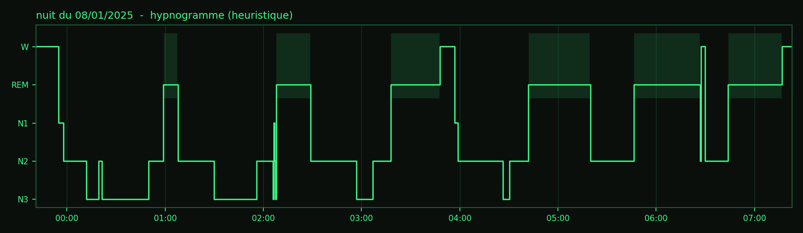

# Dream-GPIO

EEG maison sur Raspberry Pi. Huit électrodes sèches, un bonnet de bain, une carte ADS1299
et un peu trop de nuits blanches.

Le but : enregistrer mes nuits, savoir à peu près quand je suis en sommeil paradoxal,
et brancher ça sur des GPIO. Une LED, un vibreur, Home Assistant, ce que tu veux.
Du cerveau vers la maison. De la dreamIoT, si tu veux un mot qui n'existe pas.



> Première nuit entière le 8 janvier 2025. Les courbes sont dans [`nights/2025-01-08`](nights/2025-01-08).

## Ce que ça fait

- **acquisition** 8 voies à 250 Hz via le SPI du Pi (`dreamgpio/ads1299.py`)
- **filtrage** notch 50 Hz + passe-bande 0,5-35 Hz (`dreamgpio/filters.py`)
- **staging** par époques de 30 s : W / N1 / N2 / N3 / REM (`dreamgpio/staging.py`)
- **cues** LED et vibreur quand le REM dure (`dreamgpio/cues.py`), désactivé par défaut
- **MQTT** le stade courant publié sur `dreamgpio/stage` (`dreamgpio/mqtt_bridge.py`)

## Ce que ça ne fait pas

Du médical. C'est un projet perso, pas un dispositif médical, pas un diagnostic.
Le staging est une heuristique réglée sur UNE tête (la mienne). Sans EMG ni vrai EOG,
il confond N1 et REM dès que les frontales sont mal posées. Si tu veux du sérieux,
regarde [YASA](https://github.com/raphaelvallat/yasa).

## Matériel

| quoi | détail |
|---|---|
| Raspberry Pi | Zero 2 W (un Pi 3 ou 4 marche aussi) |
| ADC | module ADS1299 8 voies, SPI |
| électrodes | 8 électrodes sèches à picots + 2 clips d'oreille (référence et BIAS) |
| support | bonnet de bain en silicone percé de 8 trous |
| câble | nappe 10 fils |
| alim | **batterie USB uniquement**, voir plus bas |
| boîtier | une boîte à chaussures. oui. |

Branchement : [`hardware/wiring.md`](hardware/wiring.md).
Fabrication du bonnet : [`hardware/bonnet.md`](hardware/bonnet.md).

## Sécurité (lis ça, vraiment)

Tu mets des électrodes sur ta tête et tu dors avec. Quelques règles :

- **Jamais de secteur.** Le Pi et la carte sont sur batterie USB pendant l'enregistrement.
  Pas de chargeur branché, pas de câble vers un PC branché au mur, pas d'écran HDMI.
  Tu te connectes en SSH par le wifi, point.
- Pas d'électrode sur une peau abîmée.
- Si ça chauffe, si ça pique, tu enlèves tout.
- Les cues lumineux sont limités à 15 % de PWM. Tu peux monter, je te le déconseille.

## Installation

```bash
sudo raspi-config        # Interface Options > SPI > Enable
git clone https://github.com/SegFaultDreams/Dream-GPIO.git
cd Dream-GPIO
python3 -m venv .venv && source .venv/bin/activate
pip install -r requirements.txt
pip install -e .
```

## Utilisation

```bash
# 1. vérifier la puce et les 8 voies avec le signal de test interne
dreamgpio check

# 2. dormir
dreamgpio record --out data/raw

# 2 bis. dormir avec les cues REM et Home Assistant
dreamgpio record --out data/raw --cues --mqtt 192.168.1.20

# 3. le lendemain matin, sur le laptop
dreamgpio stage data/raw/nuit_2025-01-08_2341.csv --save stades.txt
python scripts/plot_night.py data/raw/nuit_2025-01-08_2341.csv --start 23:41 --out nights/2025-01-08
```

Les tests tournent sans le Pi (données synthétiques) :

```bash
pip install pytest
pytest
```

## Licence

MIT. Fais-en ce que tu veux, mais si tua s une idée pour le N1, ouvre une issue.
